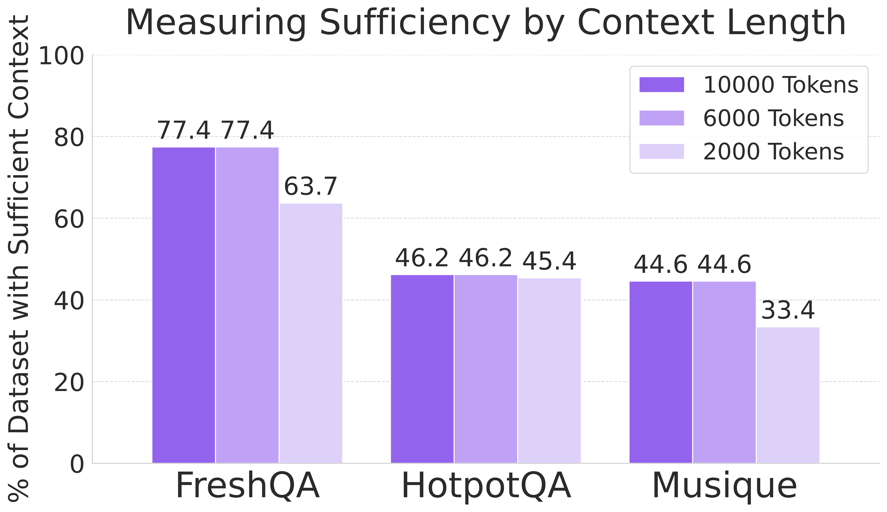

# Sufficient Context: A New Lens on Retrieval Augmented Generation Systems

## Authors
Hailey Joren (UC San Diego), Jianyi Zhang (Duke University), Chun-Sung Ferng (Google), Da-Cheng Juan (Google), Ankur Taly (Google), Cyrus Rashtchian (Google)

## ✨ Overview
When Large Language Models (LLMs) receive extra context at inference time -- so-called retrieval-augmented generation (RAG) -- overall performance often improves. But when the answer is still wrong, is it because the model failed to use the evidence or because the evidence never included enough information?

This work introduces Sufficient Context -- a test for whether the retrieved snippets alone could plausibly answer the question. Using this signal, we uncover new failure modes, design better abstention strategies, and lift selective accuracy by 2–10 percentage points at the same coverage.

## 🔑 Key Ideas & Contributions

| #  | What we did                                           | Why it matters                                                                 |
|----|--------------------------------------------------------|---------------------------------------------------------------------------------|
| 1  | Formal Definition                                      | Clear criterion: “Could a diligent reader answer using only the provided context?” Detaches evaluation from noisy ground-truth labels. |
| 2  | Autorater (93% acc)                                    | 1-shot Gemini 1.5 Pro prompt classifies sufficiency. Scales to millions of query-context pairs. |
| 3  | Dataset Diagnostics                                    | Measured sufficiency on HotPotQA, Musique-Ans, FreshQA. Reveals many “gold” snippets are in fact insufficient. |
| 4  | Model Behaviour Study                                  | Stratified error analysis on four SOTA LLMs. Shows models often hallucinate even with sufficient context, and still answer correctly ~35% of the time without it. |
| 5  | Selective RAG                                          | Combines autorater label + self-rated confidence in a tiny logistic head. Cuts hallucinations and raises answered-question accuracy by up to 10 pp. |

## 🗝️ Intuition — What Counts as Sufficient?
“If a diligent reader could craft a definitive answer using only the supplied text, then the context is sufficient.”

Multi-hop reasoning is allowed, but leaps of faith are not. Ambiguities must be fully resolved inside the snippet bundle.


## 📊 The Sufficient Context Autorater
Model: Gemini 1.5 Pro, 1-shot chain-of-thought
Benchmark: 115 human-labeled, multi-hop questions
Metrics: 93 % accuracy · 0.94 F1 (beating TRUE-NLI, FLAMe, and “answer-string-in-context” baselines)

| **Methods**                        | **F1 Score** | **Accuracy** | **Precision** | **Recall** | **No GT Answer** |
|-----------------------------------|--------------|--------------|---------------|------------|------------------|
| Gemini 1.5 Pro (1-shot)           | **0.935**    | **0.930**    | 0.935         | **0.935**  | ✓                |
| Gemini 1.5 Pro (0-shot)           | 0.878        | 0.870        | 0.885         | 0.871      | ✓                |
| FLAMe (fine-tune PaLM 24B)        | 0.892        | 0.878        | 0.853         | **0.935**  | ✓                |
| TRUE-NLI (fine-tune T5 11B)       | 0.818        | 0.826        | **0.938**     | 0.726      |                  |
| Contains GT                       | 0.810        | 0.809        | 0.870         | 0.758      |                  |

## 🔍 A New Lens on RAG Performance

### Dataset Sufficiency Rates

Many “gold” snippets are in fact insufficient, and longer context windows beyond 6k tokens yield negligible gains.

<p align="center">

</p>

### Model Error Decomposition

When context is sufficient:
- GPT-4o: 83 % correct, 13 % hallucinate, 4 % abstain
- Claude 3.5 Sonnet: 86 % correct, 3 % hallucinate, 11 % abstain

When context is **insufficient**:
- Hallucinations climb to 15–40 %
- Larger models still answer correctly up to 35 % of the time -- often via parametric memory.


### Why Can LLMs Be Correct With Insufficient Context?

| **Instance type**        | **Why model may be correct**             | **Example** |
|--------------------------|------------------------------------------|-------------|
| Yes/No question          | 50% chance of correct                    | **Q:** Is there a total eclipse in the United States this year? |
| Limited choice           | Some chance of correct                   | **Q:** Which band has more members, Chvrches or Goodbye Mr. Mackenzie? |
| Multi-hop: fragment      | Use parametric inference                 | **Q:** Who did the original voice for the character whose series Mickey’s Safari in Letterland is from?  <br> _Context says Mickey’s Safari is a video game and Walt Disney voices Mickey Mouse in cartoons. Must infer the game is in the Mickey Mouse series._ |
| Multi-hop: partial       | Use parametric knowledge                 | **Q:** Claudine’s Return starred the actress who played which role on “Married...with Children”? <br> _Context lists actresses but not their roles in “Married...with Children”. Must know extra facts._ |
| Too many hops            | Execute complex reasoning                | **Q:** How many cyclists have won all three of women’s cycling Grand Tours equivalents in the same year? <br> _Context requires cross-referencing lists of events and lists of winners while tracking winners by year._ |
| Ambiguous query          | Guess right interpretation               | **Q:** Who is the spouse of a cast member from King of the Mountain? <br> _Context has many cast members and query/context do not specify which spouse to answer about._ |
| Rater error              | Mislabel insuff. or correct              | — |
| Closed-book correct      | Known from pre-training                  | — |


## 🧠 Selective Generation with Sufficiency ✕ Confidence

We train a lightweight logistic head on two signals:
- Self-rated confidence (P-correct)
- Autorater sufficiency (binary)

The blend re-orders answers by “trustworthiness” and sets a configurable abstention threshold.


**Result:** Up to 10 pp gain in selective accuracy at the same coverage, especially on multi-hop HotPotQA.

## 📖 Citation 
```bibtex
@inproceedings{joren2025sufficient,
  title     = {Sufficient Context: A New Lens on Retrieval-Augmented Generation Systems},
  author    = {Joren, Hailey and Zhang, Jianyi and Ferng, Chun-Sung and Juan, Da-Cheng and Taly, Ankur and Rashtchian, Cyrus},
  booktitle = {International Conference on Learning Representations (ICLR)},
  year      = {2025}
}
```

## 🤝 Contact
Questions or ideas? Open an issue or email hjoren@ucsd.edu.

## 🔧 Prompts


### Sufficient Context Autorater Prompt

```text
You are an expert LLM evaluator that excels at evaluating a QUESTION and REFERENCES.
Consider the following criteria:
Sufficient Context: 1 IF the CONTEXT is sufficient to infer the answer to the question and 0
IF the CONTEXT cannot be used to infer the answer to the question
Assume the queries have timestamp <TIMESTAMP>.
First, output a list of step-by-step questions that would be used to arrive at a label for the
criteria. Make sure to include questions about assumptions implicit in the QUESTION.
Include questions about any mathematical calculations or arithmetic that would be required.
Next, answer each of the questions. Make sure to work step by step through any required
mathematical calculations or arithmetic. Finally, use these answers to evaluate the criteria.
Output the ### EXPLANATION (Text). Then, use the EXPLANATION to output the ###
EVALUATION (JSON)
EXAMPLE:
### QUESTION
In which year did the publisher of Roald Dahl’s Guide to Railway Safety cease to exist?
### References
Roald Dahl’s Guide to Railway Safety was published in 1991 by the British Railways Board.
The British Railways Board had asked Roald Dahl to write the text of the booklet, and
Quentin Blake to illustrate it, to help young people enjoy using the railways safely. The
British Railways Board (BRB) was a nationalised industry in the United Kingdom that
operated from 1963 to 2001. Until 1997 it was responsible for most railway services in Great
Britain, trading under the brand name British Railways and, from 1965, British Rail. It
did not operate railways in Northern Ireland, where railways were the responsibility of the
Government of Northern Ireland.
### EXPLANATION
The context mentions that Roald Dahl’s Guide to Railway Safety was published by the
British Railways Board. It also states that the British Railways Board operated from 1963 to
2001, meaning the year it ceased to exist was 2001. Therefore, the context does provide a
precise answer to the question.
### JSON
{"Sufficient Context": 1}
Remember the instructions: You are an expert LLM evaluator that excels at evaluating a
QUESTION and REFERENCES. Consider the following criteria:
Sufficient Context: 1 IF the CONTEXT is sufficient to infer the answer to the question and 0
IF the CONTEXT cannot be used to infer the answer to the question
Assume the queries have timestamp TIMESTAMP.
First, output a list of step-by-step questions that would be used to arrive at a label for the
criteria. Make sure to include questions about assumptions implicit in the QUESTION
Include questions about any mathematical calculations or arithmetic that would be required.
Next, answer each of the questions. Make sure to work step by step through any required
mathematical calculations or arithmetic. Finally, use these answers to evaluate the criteria.
Output the ### EXPLANATION (Text). Then, use the EXPLANATION to output the ###
EVALUATION (JSON)
### QUESTION
<question>
### REFERENCES
<context>
```

### FLAMe Prompt

```text
INSTRUCTIONS:
title: Is the context sufficient to infer the answer to the question?
description: In this task, you will be provided with documents and a question. Use one of the
following labels under ’judgment’:
1. sufficient: The documents are not sufficient to infer the answer to the question.
2. insufficient: The documents are sufficient to infer the answer to the question.
output_fields: judgment
CONTEXT:
documents:<references> question: <question>
```

### LLM Eval Prompt

```text
===Task===
I need your help in evaluating an answer provided by an LLM against ground truth answers.
Your task is to determine if the LLM’s response matches the ground truth answers. Please
analyze the provided data and make a decision.
===Instructions===
1. Carefully compare the "Predicted Answer" with the "Ground Truth Answers". 2. Consider
the substance of the answers – look for equivalent information or correct answers. Do not
focus on exact wording unless the exact wording is crucial to the meaning.
3. Your final decision should be based on whether the meaning and the vital facts of the
"Ground Truth Answers" are present in the "Predicted Answer." 4. Categorize the answer as
one of the following:
- "perfect": The answer is completely correct and matches the ground truth.
- "acceptable": The answer is partially correct or contains the main idea of the ground truth.
- "incorrect": The answer is wrong or contradicts the ground truth.
- "missing": The answer is "I don’t know", "invalid question", or similar responses indicating
lack of knowledge.
===Input Data===
- Question: What 1876 battle featured the Other Magpie?
- Predicted Answer: The Other Magpie fought in the Battle of the Rosebud.
- Ground Truth Answers: Battle of the Rosebud
===Output Format===
Provide your evaluation in the following format:
Explanation: (How you made the decision)
Decision: (One of "perfect", "acceptable", "incorrect", or "missing")
Please proceed with the evaluation.
```
